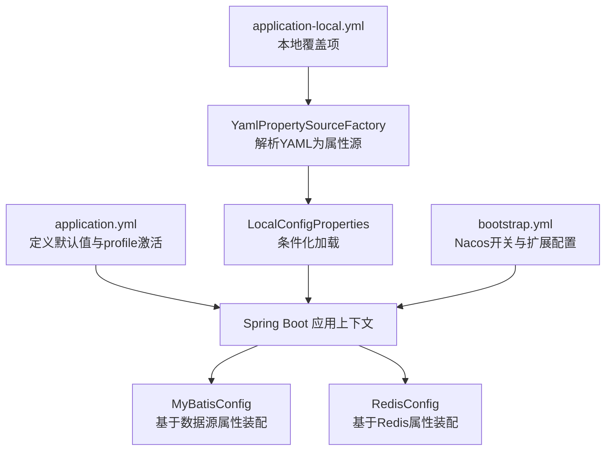
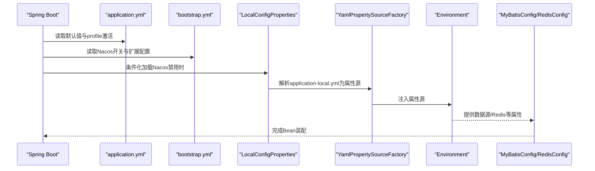
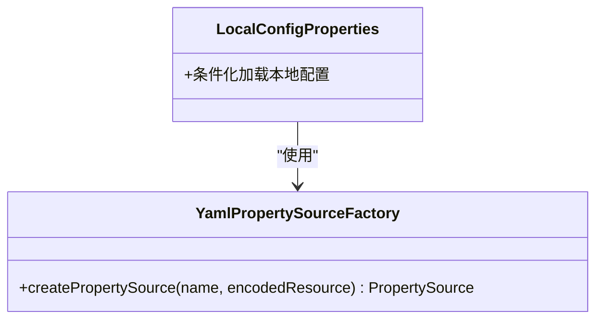
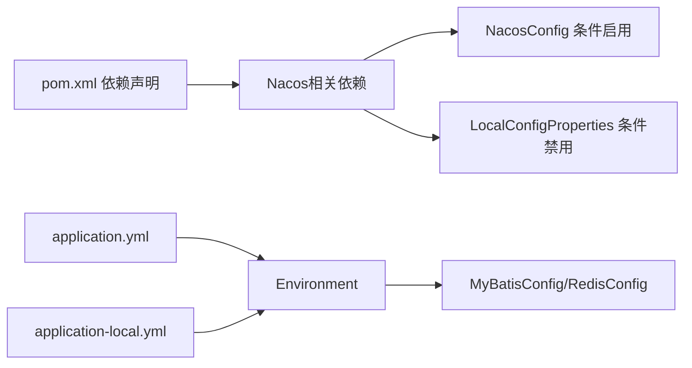

# 本地配置管理

<cite>
**本文引用的文件**
- [LocalConfigProperties.java](file://src/main/java/com/example/onlinestore/config/LocalConfigProperties.java)
- [YamlPropertySourceFactory.java](file://src/main/java/com/example/onlinestore/config/YamlPropertySourceFactory.java)
- [application-local.yml](file://src/main/resources/application-local.yml)
- [application.yml](file://src/main/resources/application.yml)
- [bootstrap.yml](file://src/main/resources/bootstrap.yml)
- [NacosConfig.java](file://src/main/java/com/example/onlinestore/config/NacosConfig.java)
- [MyBatisConfig.java](file://src/main/java/com/example/onlinestore/config/MyBatisConfig.java)
- [RedisConfig.java](file://src/main/java/com/example/onlinestore/config/RedisConfig.java)
- [pom.xml](file://pom.xml)
</cite>

## 目录
1. [引言](#引言)
2. [项目结构](#项目结构)
3. [核心组件](#核心组件)
4. [架构总览](#架构总览)
5. [详细组件分析](#详细组件分析)
6. [依赖分析](#依赖分析)
7. [性能考虑](#性能考虑)
8. [故障排查指南](#故障排查指南)
9. [结论](#结论)
10. [附录](#附录)

## 引言
本文件面向在禁用Nacos时的本地开发场景，系统性说明在线商店项目如何通过条件化配置与自定义YAML工厂加载本地配置，以及这些配置与主配置文件之间的关系、覆盖优先级与安全风险与建议。目标是帮助开发者在无需外部配置中心的情况下快速启动本地环境，并理解配置来源与优先级，从而避免常见问题。

## 项目结构
围绕本地配置管理的关键文件与职责如下：
- 配置加载入口：LocalConfigProperties 在禁用Nacos时加载 application-local.yml
- YAML解析工厂：YamlPropertySourceFactory 将YAML转换为Spring可识别的属性源
- 主配置文件：application.yml 定义默认值与profile激活策略
- 启动引导配置：bootstrap.yml 控制Nacos开关与扩展配置
- 功能配置：MyBatisConfig、RedisConfig 等基于已注入的属性进行Bean装配
- 依赖声明：pom.xml 中引入Nacos相关依赖但默认不强制启用

图表来源
- [application.yml](file://src/main/resources/application.yml#L1-L48)
- [application-local.yml](file://src/main/resources/application-local.yml#L1-L33)
- [YamlPropertySourceFactory.java](file://src/main/java/com/example/onlinestore/config/YamlPropertySourceFactory.java#L1-L26)
- [LocalConfigProperties.java](file://src/main/java/com/example/onlinestore/config/LocalConfigProperties.java#L1-L12)
- [bootstrap.yml](file://src/main/resources/bootstrap.yml#L1-L17)
- [MyBatisConfig.java](file://src/main/java/com/example/onlinestore/config/MyBatisConfig.java#L1-L27)
- [RedisConfig.java](file://src/main/java/com/example/onlinestore/config/RedisConfig.java#L1-L15)

章节来源
- [application.yml](file://src/main/resources/application.yml#L1-L48)
- [application-local.yml](file://src/main/resources/application-local.yml#L1-L33)
- [LocalConfigProperties.java](file://src/main/java/com/example/onlinestore/config/LocalConfigProperties.java#L1-L12)
- [YamlPropertySourceFactory.java](file://src/main/java/com/example/onlinestore/config/YamlPropertySourceFactory.java#L1-L26)
- [bootstrap.yml](file://src/main/resources/bootstrap.yml#L1-L17)
- [MyBatisConfig.java](file://src/main/java/com/example/onlinestore/config/MyBatisConfig.java#L1-L27)
- [RedisConfig.java](file://src/main/java/com/example/onlinestore/config/RedisConfig.java#L1-L15)
- [pom.xml](file://pom.xml#L1-L169)

## 核心组件
- LocalConfigProperties：通过条件注解仅在禁用Nacos时加载本地配置文件；使用自定义工厂解析YAML，使本地配置具备与application.yml一致的优先级。
- YamlPropertySourceFactory：将YAML资源转换为PropertiesPropertySource，供Spring Environment读取。
- application-local.yml：包含数据源、Redis、MyBatis、业务参数等本地开发所需配置。
- application.yml：定义profile激活策略与默认值，作为全局基准。
- bootstrap.yml：控制Nacos开关与扩展配置，影响远程配置拉取行为。
- MyBatisConfig、RedisConfig：基于注入的属性创建相应Bean，完成数据访问层与缓存层的装配。

章节来源
- [LocalConfigProperties.java](file://src/main/java/com/example/onlinestore/config/LocalConfigProperties.java#L1-L12)
- [YamlPropertySourceFactory.java](file://src/main/java/com/example/onlinestore/config/YamlPropertySourceFactory.java#L1-L26)
- [application-local.yml](file://src/main/resources/application-local.yml#L1-L33)
- [application.yml](file://src/main/resources/application.yml#L1-L48)
- [bootstrap.yml](file://src/main/resources/bootstrap.yml#L1-L17)
- [MyBatisConfig.java](file://src/main/java/com/example/onlinestore/config/MyBatisConfig.java#L1-L27)
- [RedisConfig.java](file://src/main/java/com/example/onlinestore/config/RedisConfig.java#L1-L15)

## 架构总览
本地配置加载与生效流程如下：
- 当 spring.cloud.nacos.enabled=false 时，LocalConfigProperties 条件化加载 application-local.yml
- YamlPropertySourceFactory 将YAML转换为属性源，加入Environment
- application.yml 的默认值与 profile 激活策略在应用启动时生效
- bootstrap.yml 控制Nacos是否参与配置拉取（在禁用Nacos时不影响本地加载）
- MyBatisConfig、RedisConfig 等根据最终生效的属性装配Bean

图表来源
- [application.yml](file://src/main/resources/application.yml#L1-L48)
- [bootstrap.yml](file://src/main/resources/bootstrap.yml#L1-L17)
- [LocalConfigProperties.java](file://src/main/java/com/example/onlinestore/config/LocalConfigProperties.java#L1-L12)
- [YamlPropertySourceFactory.java](file://src/main/java/com/example/onlinestore/config/YamlPropertySourceFactory.java#L1-L26)
- [MyBatisConfig.java](file://src/main/java/com/example/onlinestore/config/MyBatisConfig.java#L1-L27)
- [RedisConfig.java](file://src/main/java/com/example/onlinestore/config/RedisConfig.java#L1-L15)

## 详细组件分析

### LocalConfigProperties 条件化加载与YAML工厂
- 条件注解：仅当 spring.cloud.nacos.enabled=false 时才加载本地配置，避免与Nacos远程配置冲突。
- 属性源：通过 @PropertySource 指定 classpath:application-local.yml，并指定自定义工厂 YamlPropertySourceFactory。
- 工厂实现：YamlPropertySourceFactory 使用 YamlPropertiesFactoryBean 读取YAML资源，生成 Properties 并封装为 PropertiesPropertySource，交由Spring管理。

图表来源
- [LocalConfigProperties.java](file://src/main/java/com/example/onlinestore/config/LocalConfigProperties.java#L1-L12)
- [YamlPropertySourceFactory.java](file://src/main/java/com/example/onlinestore/config/YamlPropertySourceFactory.java#L1-L26)

章节来源
- [LocalConfigProperties.java](file://src/main/java/com/example/onlinestore/config/LocalConfigProperties.java#L1-L12)
- [YamlPropertySourceFactory.java](file://src/main/java/com/example/onlinestore/config/YamlPropertySourceFactory.java#L1-L26)

### application-local.yml 本地配置项说明
- 数据源（spring.datasource）
  - 驱动类名、URL、用户名、密码
  - 本地开发常用本地MySQL实例
- Redis（spring.data.redis）
  - 主机、端口、密码、数据库索引
  - 连接池参数（最大活跃、最大空闲、最小空闲、最大等待）
- MyBatis（mybatis）
  - Mapper映射文件位置、类型别名包、驼峰命名映射
- 业务参数（service.admin）
  - 用户服务基础地址、管理员账号与密码

章节来源
- [application-local.yml](file://src/main/resources/application-local.yml#L1-L33)

### 与 application.yml 占位符的对应关系
- profile激活：application.yml 通过 SPRING_PROFILES_ACTIVE 指定默认激活的profile（默认local），确保本地开发时优先加载本地配置。
- Nacos开关：application.yml 与 bootstrap.yml 通过 NACOS_ENABLED 控制Nacos开关；当禁用时，LocalConfigProperties 才会加载本地配置。
- 默认值：application.yml 提供全局默认值，application-local.yml 作为本地覆盖项，二者共同决定最终生效属性。

章节来源
- [application.yml](file://src/main/resources/application.yml#L1-L48)
- [bootstrap.yml](file://src/main/resources/bootstrap.yml#L1-L17)

### profile激活机制与覆盖优先级
- profile激活：application.yml 中的 profiles.active 通过环境变量 SPRING_PROFILES_ACTIVE 决定，默认local，确保本地开发优先使用本地配置。
- 覆盖顺序（简化）：bootstrap.yml -> application.yml -> application-local.yml（在禁用Nacos且条件满足时）
- 说明：application-local.yml 通过 @PropertySource 加载后，其键值会覆盖 application.yml 中同名键的值，从而实现“本地覆盖”的目的。

章节来源
- [application.yml](file://src/main/resources/application.yml#L1-L48)
- [LocalConfigProperties.java](file://src/main/java/com/example/onlinestore/config/LocalConfigProperties.java#L1-L12)

### MyBatis 与 Redis Bean 装配
- MyBatisConfig：基于注入的 DataSource 自动装配 SqlSessionFactory，设置Mapper位置与驼峰映射。
- RedisConfig：基于 RedisConnectionFactory 自动装配 StringRedisTemplate。

章节来源
- [MyBatisConfig.java](file://src/main/java/com/example/onlinestore/config/MyBatisConfig.java#L1-L27)
- [RedisConfig.java](file://src/main/java/com/example/onlinestore/config/RedisConfig.java#L1-L15)

### 为什么需要独立的本地配置文件
- 快速启动：本地开发无需连接Nacos即可启动，降低环境依赖与网络开销。
- 易于隔离：本地配置与远程配置分离，避免误改生产配置。
- 可移植性：团队成员可在不同机器上快速复现一致的本地运行环境。

章节来源
- [LocalConfigProperties.java](file://src/main/java/com/example/onlinestore/config/LocalConfigProperties.java#L1-L12)
- [application-local.yml](file://src/main/resources/application-local.yml#L1-L33)

### 配置安全风险与建议
- 明文密码风险：本地配置文件包含数据库与Redis密码，若被泄露将带来安全威胁。
- 建议措施：
  - 使用环境变量覆盖敏感字段（如数据库密码、Redis密码），在CI/CD中通过密文注入，在本地通过IDE或脚本注入。
  - 对关键配置采用配置加密方案（如Spring Cloud Config加解密或第三方加密库），并在启动前解密。
  - 限制本地配置文件权限，仅允许开发者账户访问。
  - 在版本控制中忽略本地敏感配置，仅保留模板文件（如 application-local.yml.template）。

章节来源
- [application-local.yml](file://src/main/resources/application-local.yml#L1-L33)
- [application.yml](file://src/main/resources/application.yml#L1-L48)

## 依赖分析
- 条件依赖：LocalConfigProperties 依赖 spring.cloud.nacos.enabled=false 的条件；NacosConfig 依赖 spring.cloud.nacos.enabled=true 的条件。
- 属性依赖：MyBatisConfig、RedisConfig 依赖 application.yml 与 application-local.yml 中的对应键。
- 外部依赖：pom.xml 引入Nacos相关依赖，但通过开关控制是否启用。

图表来源
- [pom.xml](file://pom.xml#L1-L169)
- [NacosConfig.java](file://src/main/java/com/example/onlinestore/config/NacosConfig.java#L1-L29)
- [LocalConfigProperties.java](file://src/main/java/com/example/onlinestore/config/LocalConfigProperties.java#L1-L12)
- [application.yml](file://src/main/resources/application.yml#L1-L48)
- [application-local.yml](file://src/main/resources/application-local.yml#L1-L33)
- [MyBatisConfig.java](file://src/main/java/com/example/onlinestore/config/MyBatisConfig.java#L1-L27)
- [RedisConfig.java](file://src/main/java/com/example/onlinestore/config/RedisConfig.java#L1-L15)

章节来源
- [pom.xml](file://pom.xml#L1-L169)
- [NacosConfig.java](file://src/main/java/com/example/onlinestore/config/NacosConfig.java#L1-L29)
- [LocalConfigProperties.java](file://src/main/java/com/example/onlinestore/config/LocalConfigProperties.java#L1-L12)
- [application.yml](file://src/main/resources/application.yml#L1-L48)
- [application-local.yml](file://src/main/resources/application-local.yml#L1-L33)
- [MyBatisConfig.java](file://src/main/java/com/example/onlinestore/config/MyBatisConfig.java#L1-L27)
- [RedisConfig.java](file://src/main/java/com/example/onlinestore/config/RedisConfig.java#L1-L15)

## 性能考虑
- 启动时间：禁用Nacos可减少网络请求与远程配置拉取，缩短启动时间。
- 配置解析：YAML解析为属性源的开销极小，对整体性能影响可忽略。
- 连接池：Redis连接池参数已在本地配置中设定，可根据实际负载调整。

## 故障排查指南
- 无法加载本地配置
  - 检查 spring.cloud.nacos.enabled 是否为 false
  - 确认 application-local.yml 路径与文件名正确
  - 确认 YamlPropertySourceFactory 已被使用
- 数据源/Redis连接失败
  - 核对本地MySQL与Redis服务状态
  - 校验 application-local.yml 中的主机、端口、密码
- profile未生效
  - 检查 SPRING_PROFILES_ACTIVE 是否为 local
  - 确认 application.yml 的 profiles.active 未被其他地方覆盖

章节来源
- [LocalConfigProperties.java](file://src/main/java/com/example/onlinestore/config/LocalConfigProperties.java#L1-L12)
- [YamlPropertySourceFactory.java](file://src/main/java/com/example/onlinestore/config/YamlPropertySourceFactory.java#L1-L26)
- [application.yml](file://src/main/resources/application.yml#L1-L48)
- [application-local.yml](file://src/main/resources/application-local.yml#L1-L33)

## 结论
通过条件化加载与自定义YAML工厂，项目在禁用Nacos时仍能稳定地从 application-local.yml 获取本地配置，结合application.yml的默认值与profile激活策略，实现了开发环境的快速启动与灵活覆盖。建议在本地环境中优先使用环境变量覆盖敏感配置，并配合加密与权限控制，确保配置安全。

## 附录
- 关键路径参考
  - 条件化加载：[LocalConfigProperties.java](file://src/main/java/com/example/onlinestore/config/LocalConfigProperties.java#L1-L12)
  - YAML工厂：[YamlPropertySourceFactory.java](file://src/main/java/com/example/onlinestore/config/YamlPropertySourceFactory.java#L1-L26)
  - 本地配置：[application-local.yml](file://src/main/resources/application-local.yml#L1-L33)
  - 全局默认与profile：[application.yml](file://src/main/resources/application.yml#L1-L48)
  - Nacos开关与扩展配置：[bootstrap.yml](file://src/main/resources/bootstrap.yml#L1-L17)
  - MyBatis装配：[MyBatisConfig.java](file://src/main/java/com/example/onlinestore/config/MyBatisConfig.java#L1-L27)
  - Redis装配：[RedisConfig.java](file://src/main/java/com/example/onlinestore/config/RedisConfig.java#L1-L15)
  - 依赖声明：[pom.xml](file://pom.xml#L1-L169)