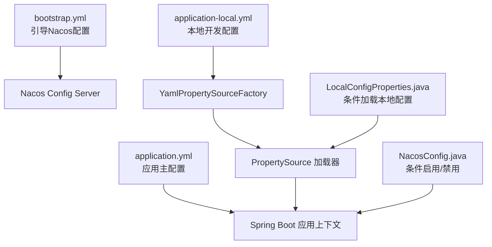
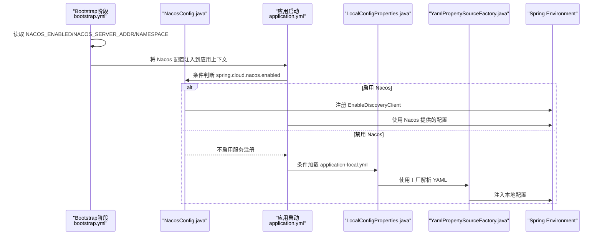
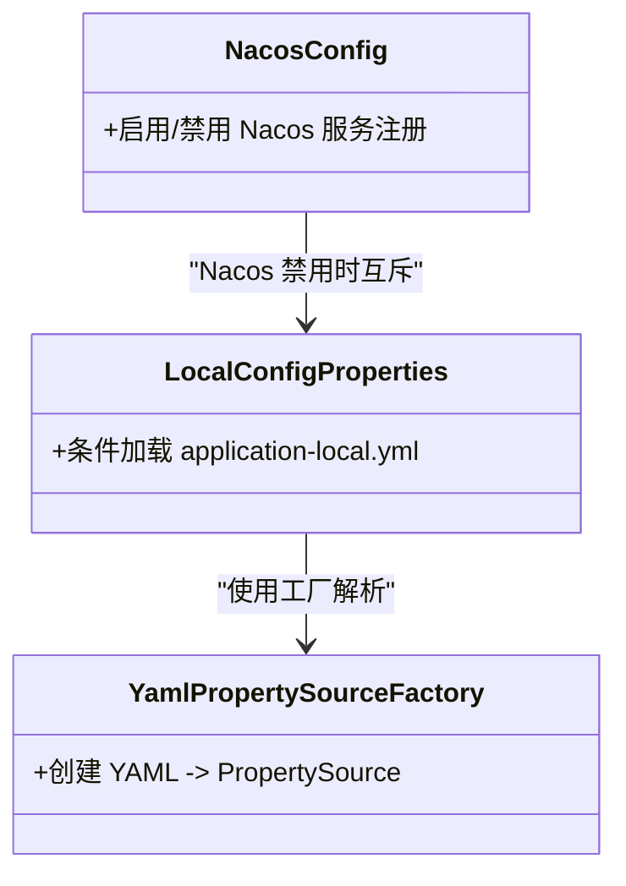
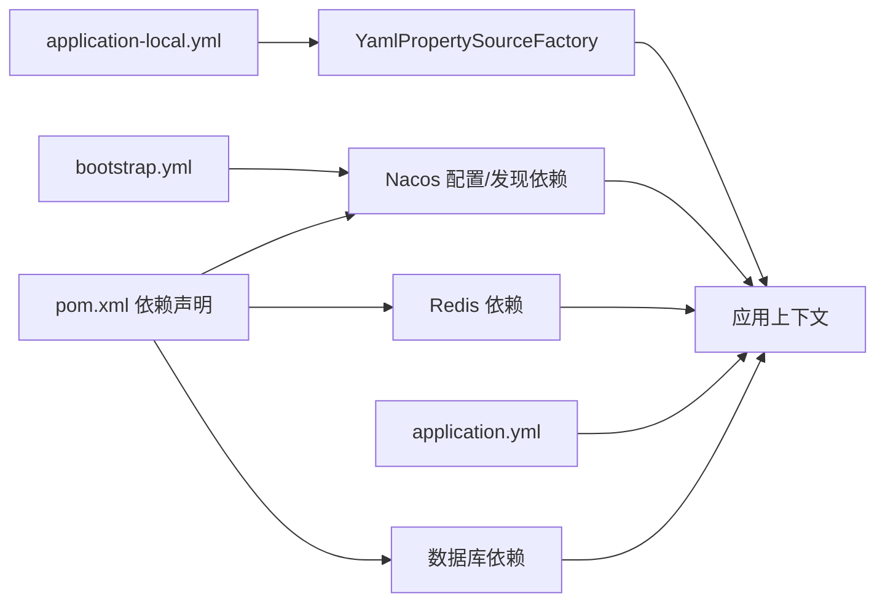

# 配置管理

<cite>
**本文引用的文件**
- [bootstrap.yml](file://src/main/resources/bootstrap.yml)
- [application.yml](file://src/main/resources/application.yml)
- [application-local.yml](file://src/main/resources/application-local.yml)
- [LocalConfigProperties.java](file://src/main/java/com/example/onlinestore/config/LocalConfigProperties.java)
- [YamlPropertySourceFactory.java](file://src/main/java/com/example/onlinestore/config/YamlPropertySourceFactory.java)
- [NacosConfig.java](file://src/main/java/com/example/onlinestore/config/NacosConfig.java)
- [pom.xml](file://pom.xml)
</cite>

## 目录
1. [简介](#简介)
2. [项目结构](#项目结构)
3. [核心组件](#核心组件)
4. [架构总览](#架构总览)
5. [详细组件分析](#详细组件分析)
6. [依赖关系分析](#依赖关系分析)
7. [性能与可用性考虑](#性能与可用性考虑)
8. [故障排查指南](#故障排查指南)
9. [结论](#结论)
10. [附录：配置项分类与环境策略](#附录配置项分类与环境策略)

## 简介
本文件面向 online-store 项目的配置管理，系统性说明两种配置加载模式：
- Nacos 配置中心模式：通过 bootstrap.yml 引导 Spring Cloud Alibaba Nacos，从 Nacos 服务器拉取配置，并支持动态刷新。
- 本地 YAML 模式：当 Nacos 被禁用时，自动加载 application-local.yml 并以 YamlPropertySourceFactory 解析。

同时，文档解释了 bootstrap.yml 如何引导 Nacos 配置加载，application.yml 中动态属性（如 ${NACOS_ENABLED:false}）如何实现环境切换；并介绍 LocalConfigProperties 类与 YamlPropertySourceFactory 在 Nacos 禁用时的作用机制。最后，对配置项进行分类说明，并给出开发/测试/生产三类环境下的推荐配置策略，强调配置安全（如密码加密）的重要性。

## 项目结构
在线上商店项目中，配置相关的关键位置如下：
- 启动引导配置：bootstrap.yml
- 应用主配置：application.yml
- 本地开发配置：application-local.yml
- 配置加载与条件装配：
  - NacosConfig.java：基于属性开关启用/禁用 Nacos 服务注册
  - LocalConfigProperties.java：当 Nacos 禁用时加载本地 YAML
  - YamlPropertySourceFactory.java：将 YAML 资源转换为 Spring PropertySource

图表来源
- [bootstrap.yml](file://src/main/resources/bootstrap.yml#L1-L17)
- [application.yml](file://src/main/resources/application.yml#L1-L48)
- [application-local.yml](file://src/main/resources/application-local.yml#L1-L33)
- [NacosConfig.java](file://src/main/java/com/example/onlinestore/config/NacosConfig.java#L1-L29)
- [LocalConfigProperties.java](file://src/main/java/com/example/onlinestore/config/LocalConfigProperties.java#L1-L12)
- [YamlPropertySourceFactory.java](file://src/main/java/com/example/onlinestore/config/YamlPropertySourceFactory.java#L1-L26)

章节来源
- [bootstrap.yml](file://src/main/resources/bootstrap.yml#L1-L17)
- [application.yml](file://src/main/resources/application.yml#L1-L48)
- [application-local.yml](file://src/main/resources/application-local.yml#L1-L33)
- [NacosConfig.java](file://src/main/java/com/example/onlinestore/config/NacosConfig.java#L1-L29)
- [LocalConfigProperties.java](file://src/main/java/com/example/onlinestore/config/LocalConfigProperties.java#L1-L12)
- [YamlPropertySourceFactory.java](file://src/main/java/com/example/onlinestore/config/YamlPropertySourceFactory.java#L1-L26)

## 核心组件
- NacosConfig.java：通过条件注解控制是否启用 Nacos 服务注册，默认开启，可通过属性关闭。
- LocalConfigProperties.java：当 Nacos 禁用时，使用 @PropertySource 和自定义工厂加载 application-local.yml。
- YamlPropertySourceFactory.java：将 YAML 资源解析为 Properties 并注入到 Spring Environment。
- bootstrap.yml：声明 Nacos 的开关、地址、命名空间、分组、扩展配置等，支撑 Nacos 配置中心模式。
- application.yml：声明应用端口、激活的 Profile、Nacos 发现/注册开关、数据源、Redis、MyBatis、业务参数等。
- application-local.yml：本地开发环境的数据源、Redis、MyBatis、业务参数等。

章节来源
- [NacosConfig.java](file://src/main/java/com/example/onlinestore/config/NacosConfig.java#L1-L29)
- [LocalConfigProperties.java](file://src/main/java/com/example/onlinestore/config/LocalConfigProperties.java#L1-L12)
- [YamlPropertySourceFactory.java](file://src/main/java/com/example/onlinestore/config/YamlPropertySourceFactory.java#L1-L26)
- [bootstrap.yml](file://src/main/resources/bootstrap.yml#L1-L17)
- [application.yml](file://src/main/resources/application.yml#L1-L48)
- [application-local.yml](file://src/main/resources/application-local.yml#L1-L33)

## 架构总览
下图展示了 Nacos 与本地 YAML 两种模式的加载路径与交互关系：

图表来源
- [bootstrap.yml](file://src/main/resources/bootstrap.yml#L1-L17)
- [NacosConfig.java](file://src/main/java/com/example/onlinestore/config/NacosConfig.java#L1-L29)
- [application.yml](file://src/main/resources/application.yml#L1-L48)
- [LocalConfigProperties.java](file://src/main/java/com/example/onlinestore/config/LocalConfigProperties.java#L1-L12)
- [YamlPropertySourceFactory.java](file://src/main/java/com/example/onlinestore/config/YamlPropertySourceFactory.java#L1-L26)

## 详细组件分析

### bootstrap.yml：引导 Nacos 配置加载
- 关键点
  - spring.application.name：应用名，用于 Nacos 命名空间与数据 ID 组合。
  - spring.cloud.nacos.enabled：控制 Nacos 配置与发现的总开关。
  - spring.cloud.nacos.config.enabled：控制是否启用 Nacos 配置中心。
  - spring.cloud.nacos.config.server-addr：Nacos 服务器地址，默认本地。
  - spring.cloud.nacos.config.file-extension：配置文件扩展名为 yml。
  - spring.cloud.nacos.config.namespace：命名空间，可为空。
  - spring.cloud.nacos.config.group：分组，默认 DEFAULT_GROUP。
  - spring.cloud.nacos.config.refresh-enabled：启用动态刷新。
  - spring.cloud.nacos.config.extension-configs：扩展配置列表，包含 online-store.yaml 的 data-id、group 与刷新开关。

- 动态属性与环境切换
  - ${NACOS_ENABLED:false}：默认禁用，可在部署时通过环境变量或外部配置覆盖为 true。
  - ${NACOS_SERVER_ADDR:localhost:8848}、${NACOS_NAMESPACE:}：允许在不同环境覆盖地址与命名空间。

- 作用流程
  - Spring Cloud Bootstrap 阶段先于应用上下文初始化，读取 bootstrap.yml 并连接 Nacos。
  - 若启用，Nacos 将提供 application.yml 中的配置项；若禁用，则跳过 Nacos，进入本地加载。

章节来源
- [bootstrap.yml](file://src/main/resources/bootstrap.yml#L1-L17)

### application.yml：应用主配置与动态属性
- 关键点
  - server.port：应用监听端口。
  - spring.profiles.active：当前激活的 Profile，默认 local。
  - spring.cloud.nacos.discovery.enabled/register-enabled/auto-registration.enabled：均受 NACOS_ENABLED 控制。
  - spring.datasource：数据库驱动、URL、用户名、密码占位符。
  - spring.data.redis：Redis 主机、端口、密码、数据库索引、连接池参数。
  - mybatis：映射文件位置、类型别名包、驼峰命名映射。
  - service.user.base-url：业务参数示例。
  - admin.auth.username/password：管理端认证参数。

- 动态属性与环境切换
  - ${SPRING_PROFILES_ACTIVE:local}：默认激活 local，可在 CI/CD 或容器环境中覆盖。
  - ${NACOS_ENABLED:false}：统一控制 Nacos 相关功能的启停。

- 本地 YAML 的补充
  - application-local.yml 与 application.yml 结构一致，便于在本地禁用 Nacos 时直接复用。

章节来源
- [application.yml](file://src/main/resources/application.yml#L1-L48)
- [application-local.yml](file://src/main/resources/application-local.yml#L1-L33)

### NacosConfig.java：条件启用/禁用 Nacos 服务注册
- 关键点
  - @EnableDiscoveryClient：启用服务发现客户端。
  - @ConditionalOnProperty(name = "spring.cloud.nacos.enabled", havingValue = "true", matchIfMissing = true)：默认启用，显式设置为 false 才禁用。
  - 该类仅作为条件装配入口，不包含业务逻辑。

- 与 application.yml 的联动
  - 当 NACOS_ENABLED 为 true 时，应用会启用服务注册与发现；为 false 时，跳过 Nacos。

章节来源
- [NacosConfig.java](file://src/main/java/com/example/onlinestore/config/NacosConfig.java#L1-L29)

### LocalConfigProperties.java：Nacos 禁用时加载本地 YAML
- 关键点
  - @ConditionalOnProperty(name = "spring.cloud.nacos.enabled", havingValue = "false")：仅当 Nacos 禁用时生效。
  - @PropertySource(value = "classpath:application-local.yml", factory = YamlPropertySourceFactory.class)：指定本地 YAML 资源与自定义工厂。
  - 该类仅承担“加载本地配置”的职责，无其他成员。

- 与 YamlPropertySourceFactory 的协作
  - 通过工厂将 YAML 转换为 Properties 并注入到 Spring Environment，优先级低于 Nacos 提供的配置。

章节来源
- [LocalConfigProperties.java](file://src/main/java/com/example/onlinestore/config/LocalConfigProperties.java#L1-L12)
- [YamlPropertySourceFactory.java](file://src/main/java/com/example/onlinestore/config/YamlPropertySourceFactory.java#L1-L26)

### YamlPropertySourceFactory.java：YAML 到 PropertySource 的转换
- 关键点
  - 使用 YamlPropertiesFactoryBean 读取资源并生成 Properties。
  - 将 Properties 包装为 PropertiesPropertySource 并返回，供 @PropertySource 使用。
  - 保证 application-local.yml 可被 Spring 正确解析。

- 复杂度与性能
  - 时间复杂度近似 O(n)，n 为 YAML 键值对数量；空间复杂度 O(n)。
  - 仅在本地模式加载一次，开销可忽略。

章节来源
- [YamlPropertySourceFactory.java](file://src/main/java/com/example/onlinestore/config/YamlPropertySourceFactory.java#L1-L26)

### 类关系图

图表来源
- [NacosConfig.java](file://src/main/java/com/example/onlinestore/config/NacosConfig.java#L1-L29)
- [LocalConfigProperties.java](file://src/main/java/com/example/onlinestore/config/LocalConfigProperties.java#L1-L12)
- [YamlPropertySourceFactory.java](file://src/main/java/com/example/onlinestore/config/YamlPropertySourceFactory.java#L1-L26)

## 依赖关系分析
- Maven 依赖
  - spring-cloud-starter-alibaba-nacos-config、spring-cloud-starter-alibaba-nacos-discovery、spring-cloud-starter-bootstrap、nacos-client：为 Nacos 配置中心与服务发现提供运行时支持。
  - spring-boot-starter-data-redis、jedis：为 Redis 客户端提供支持。
  - mybatis-spring-boot-starter、mysql-connector-j：为数据库访问提供支持。

- 配置加载顺序与优先级
  - bootstrap.yml 先于 application.yml 加载，且 Nacos 提供的配置优先于本地 YAML。
  - 当 Nacos 启用时，本地 application-local.yml 不生效；当 Nacos 禁用时，LocalConfigProperties 生效并加载 application-local.yml。

图表来源
- [pom.xml](file://pom.xml#L85-L108)
- [bootstrap.yml](file://src/main/resources/bootstrap.yml#L1-L17)
- [application.yml](file://src/main/resources/application.yml#L1-L48)
- [application-local.yml](file://src/main/resources/application-local.yml#L1-L33)
- [YamlPropertySourceFactory.java](file://src/main/java/com/example/onlinestore/config/YamlPropertySourceFactory.java#L1-L26)

章节来源
- [pom.xml](file://pom.xml#L85-L108)

## 性能与可用性考虑
- Nacos 模式
  - 启用动态刷新后，配置变更可即时生效，减少重启成本。
  - 建议在生产环境为 Nacos 配置设置合理的超时与重试策略，避免网络抖动影响启动。
- 本地 YAML 模式
  - 适合开发/测试环境，启动快、无需外部依赖。
  - 注意不要将敏感信息写入 application-local.yml，避免误提交。
- Profile 切换
  - 通过 SPRING_PROFILES_ACTIVE 快速切换环境配置，建议在 CI/CD 中统一管理。

[本节为通用指导，不直接分析具体文件]

## 故障排查指南
- 症状：应用启动时报 Nacos 连接失败
  - 排查要点：确认 NACOS_ENABLED 是否为 true；检查 NACOS_SERVER_ADDR 是否可达；核对 NACOS_NAMESPACE 是否正确。
  - 参考文件：[bootstrap.yml](file://src/main/resources/bootstrap.yml#L1-L17)
- 症状：本地无法加载 application-local.yml
  - 排查要点：确认 Nacos 已禁用（NACOS_ENABLED=false）；检查 LocalConfigProperties 条件注解是否满足；验证 YamlPropertySourceFactory 是否被调用。
  - 参考文件：[LocalConfigProperties.java](file://src/main/java/com/example/onlinestore/config/LocalConfigProperties.java#L1-L12)、[YamlPropertySourceFactory.java](file://src/main/java/com/example/onlinestore/config/YamlPropertySourceFactory.java#L1-L26)
- 症状：Profile 切换无效
  - 排查要点：确认 SPRING_PROFILES_ACTIVE 是否被正确设置；检查 application.yml 中的 profiles.active 是否被覆盖。
  - 参考文件：[application.yml](file://src/main/resources/application.yml#L1-L48)
- 症状：数据库或 Redis 密码未生效
  - 排查要点：确认 Nacos 提供的配置优先级高于本地 YAML；在 Nacos 中正确下发密钥；或在本地确保 application-local.yml 中的密码字段已填写。
  - 参考文件：[application.yml](file://src/main/resources/application.yml#L1-L48)、[application-local.yml](file://src/main/resources/application-local.yml#L1-L33)

章节来源
- [bootstrap.yml](file://src/main/resources/bootstrap.yml#L1-L17)
- [application.yml](file://src/main/resources/application.yml#L1-L48)
- [application-local.yml](file://src/main/resources/application-local.yml#L1-L33)
- [LocalConfigProperties.java](file://src/main/java/com/example/onlinestore/config/LocalConfigProperties.java#L1-L12)
- [YamlPropertySourceFactory.java](file://src/main/java/com/example/onlinestore/config/YamlPropertySourceFactory.java#L1-L26)

## 结论
- online-store 通过 bootstrap.yml 与 application.yml 的协同，实现了 Nacos 与本地 YAML 两种配置模式的无缝切换。
- NacosConfig.java 与 LocalConfigProperties.java 通过条件注解精确控制加载路径，确保在不同环境下只加载一套配置。
- YamlPropertySourceFactory.java 保障了本地 YAML 的稳定解析与注入。
- 建议在生产环境优先采用 Nacos，结合动态刷新与严格的权限控制；在开发/测试环境可使用本地 YAML，但务必注意敏感信息的安全管理。

[本节为总结性内容，不直接分析具体文件]

## 附录：配置项分类与环境策略

### 配置项分类说明
- 服务器
  - server.port：应用监听端口
  - 参考路径：[application.yml](file://src/main/resources/application.yml#L1-L48)
- 数据源
  - spring.datasource.driver-class-name、url、username、password
  - 参考路径：[application.yml](file://src/main/resources/application.yml#L1-L48)、[application-local.yml](file://src/main/resources/application-local.yml#L1-L33)
- Redis
  - spring.data.redis.host、port、password、database、jedis.pool.*
  - 参考路径：[application.yml](file://src/main/resources/application.yml#L1-L48)、[application-local.yml](file://src/main/resources/application-local.yml#L1-L33)
- 业务参数
  - mybatis.mapper-locations、type-aliases-package、configuration.map-underscore-to-camel-case
  - service.user.base-url
  - admin.auth.username、admin.auth.password
  - 参考路径：[application.yml](file://src/main/resources/application.yml#L1-L48)、[application-local.yml](file://src/main/resources/application-local.yml#L1-L33)

### 环境策略（开发/测试/生产）
- 开发环境
  - SPRING_PROFILES_ACTIVE=local
  - NACOS_ENABLED=false，使用本地 application-local.yml
  - 参考路径：[application.yml](file://src/main/resources/application.yml#L1-L48)、[application-local.yml](file://src/main/resources/application-local.yml#L1-L33)
- 测试环境
  - SPRING_PROFILES_ACTIVE=test
  - NACOS_ENABLED=true，使用 Nacos 提供的配置，建议独立 namespace/group
  - 参考路径：[bootstrap.yml](file://src/main/resources/bootstrap.yml#L1-L17)
- 生产环境
  - SPRING_PROFILES_ACTIVE=prod
  - NACOS_ENABLED=true，严格控制命名空间与权限；数据库与 Redis 密码通过 Nacos 注入
  - 参考路径：[bootstrap.yml](file://src/main/resources/bootstrap.yml#L1-L17)、[application.yml](file://src/main/resources/application.yml#L1-L48)

### 配置安全建议
- 密码与敏感信息
  - 建议将数据库密码、Redis 密码、第三方密钥等放入 Nacos 并启用加密存储或访问控制。
  - 本地开发避免明文密码，必要时使用占位符并在启动时注入。
- 访问控制
  - 为不同环境设置独立 namespace 与 group，限制访问范围。
- 动态刷新与审计
  - 启用动态刷新时，记录配置变更历史，确保可追溯。
- 最小暴露原则
  - 仅在需要的环境暴露必要的配置项，避免过度公开。

[本节为通用指导，不直接分析具体文件]