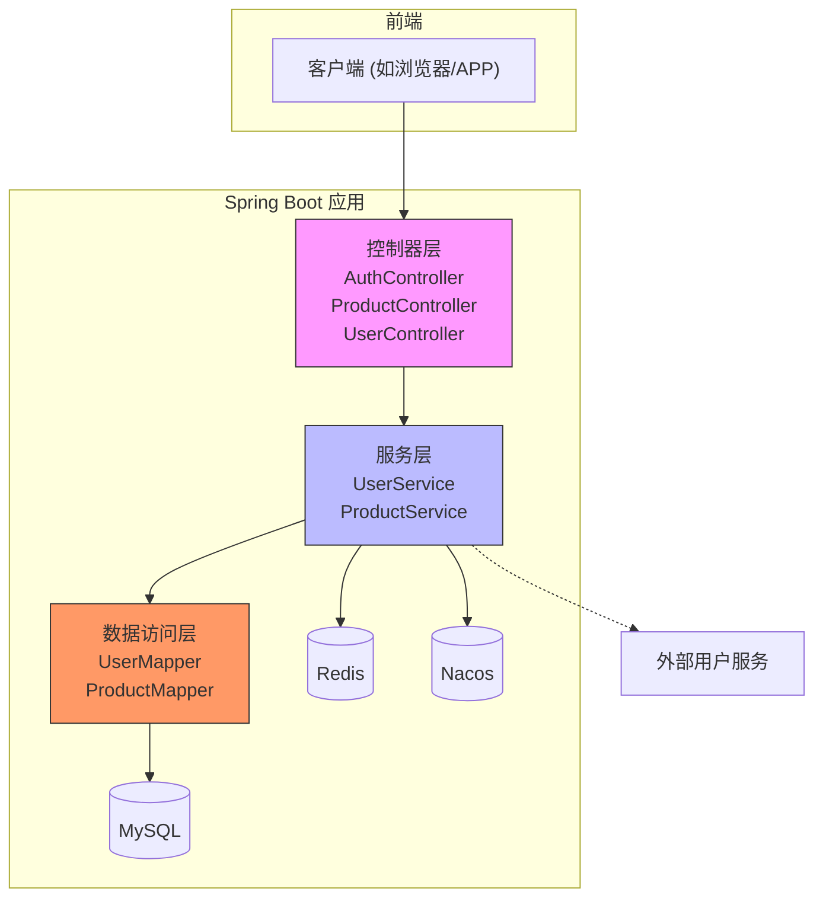
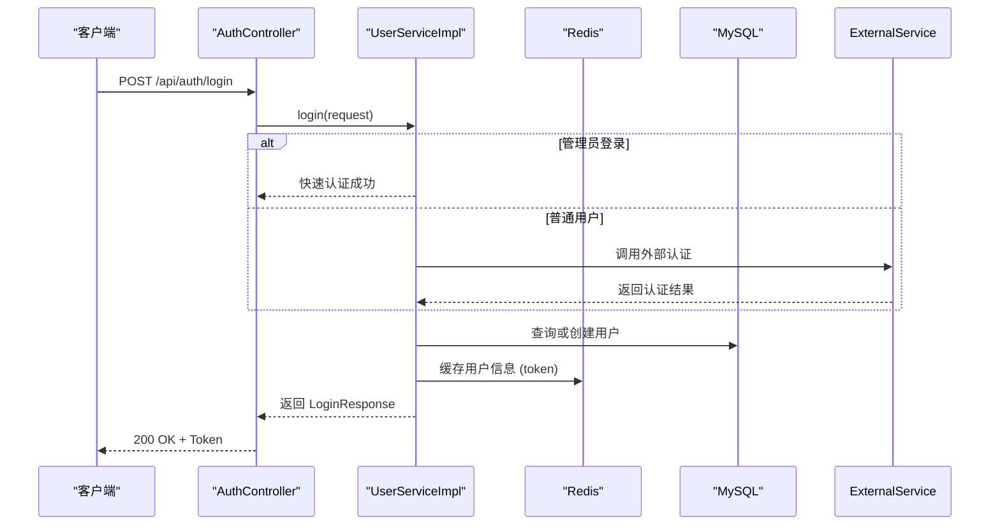
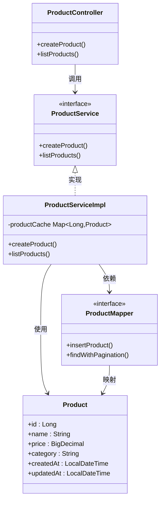
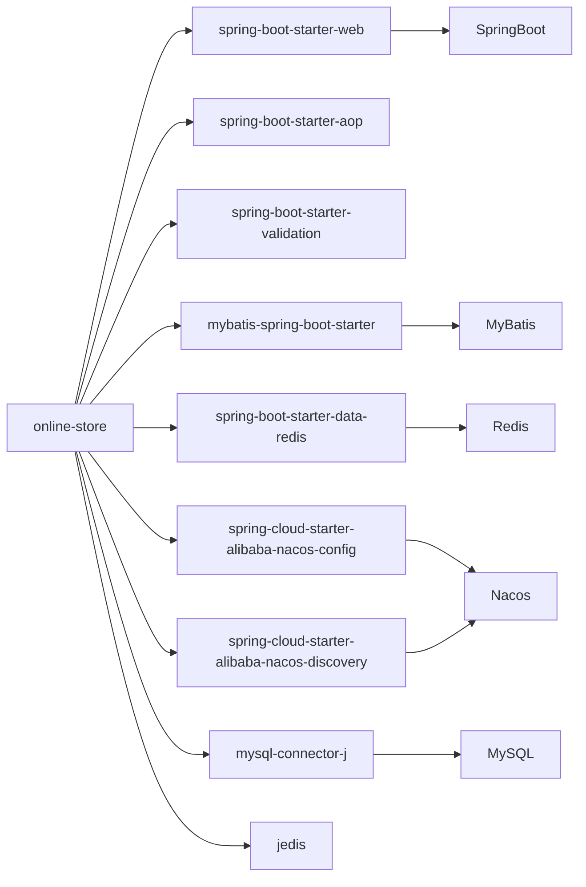

# 项目概述

<cite>
**本文档中引用的文件**  
- [OnlineStoreApplication.java](file://src/main/java/com/example/onlinestore/OnlineStoreApplication.java)
- [application.yml](file://src/main/resources/application.yml)
- [bootstrap.yml](file://src/main/resources/bootstrap.yml)
- [AuthController.java](file://src/main/java/com/example/onlinestore/controller/AuthController.java)
- [ProductController.java](file://src/main/java/com/example/onlinestore/controller/ProductController.java)
- [UserController.java](file://src/main/java/com/example/onlinestore/controller/UserController.java)
- [UserService.java](file://src/main/java/com/example/onlinestore/service/UserService.java)
- [ProductService.java](file://src/main/java/com/example/onlinestore/service/ProductService.java)
- [UserServiceImpl.java](file://src/main/java/com/example/onlinestore/service/impl/UserServiceImpl.java)
- [ProductServiceImpl.java](file://src/main/java/com/example/onlinestore/service/impl/ProductServiceImpl.java)
- [UserMapper.java](file://src/main/java/com/example/onlinestore/mapper/UserMapper.java)
- [ProductMapper.java](file://src/main/java/com/example/onlinestore/mapper/ProductMapper.java)
- [User.java](file://src/main/java/com/example/onlinestore/model/User.java)
- [Product.java](file://src/main/java/com/example/onlinestore/model/Product.java)
- [pom.xml](file://pom.xml)
- [README.md](file://README.md)
</cite>

## 目录
1. [简介](#简介)
2. [项目结构](#项目结构)
3. [核心组件](#核心组件)
4. [架构概览](#架构概览)
5. [详细组件分析](#详细组件分析)
6. [依赖分析](#依赖分析)
7. [性能考虑](#性能考虑)
8. [故障排除指南](#故障排除指南)
9. [结论](#结论)

## 简介
`online-store` 是一个基于 Spring Boot 和 Spring Cloud 的电商平台后端服务，旨在提供用户认证、商品管理等核心功能。该项目采用微服务架构设计，集成 Nacos 作为服务发现与配置中心，使用 Redis 缓存用户会话和商品数据，MySQL 作为持久化存储。系统通过模块化设计实现了高内聚低耦合，并支持国际化消息处理。本项目适用于初学者理解现代 Java 后端开发实践，同时也为高级开发者提供了可扩展的技术集成示例。

## 项目结构
项目遵循标准的 Maven 多层架构，组织清晰，职责分明：

```
online-store/
├── src/
│   ├── main/
│   │   ├── java/
│   │   │   └── com.example.onlinestore/
│   │   │       ├── annotation/           # 自定义注解
│   │   │       ├── aspect/               # AOP 切面
│   │   │       ├── config/               # 配置类
│   │   │       ├── context/              # 上下文工具
│   │   │       ├── controller/           # 控制器层
│   │   │       ├── dto/                  # 数据传输对象
│   │   │       ├── interceptor/          # 拦截器
│   │   │       ├── mapper/               # MyBatis 映射接口
│   │   │       ├── model/                # 实体类
│   │   │       ├── service/              # 业务逻辑接口及实现
│   │   │       └── OnlineStoreApplication.java # 启动类
│   │   └── resources/
│   │       ├── db/schema.sql             # 数据库脚本
│   │       ├── i18n/messages*.properties # 国际化资源
│   │       ├── mapper/*.xml              # MyBatis SQL 映射文件
│   │       ├── application.yml           # 主配置文件
│   │       └── bootstrap.yml             # 引导配置（Nacos）
├── pom.xml                               # Maven 构建配置
└── README.md                             # 项目说明文档
```

**Diagram sources**  
- [README.md](file://README.md#L1-L55)

**本节来源**  
- [README.md](file://README.md#L1-L55)

## 核心组件
项目由多个核心组件构成，包括控制器、服务层、数据访问层以及配置类。控制器负责接收 HTTP 请求并调用服务层处理业务逻辑；服务层封装核心业务规则并协调数据访问；数据访问层通过 MyBatis 与数据库交互；配置类则完成外部系统（如 Nacos、Redis）的集成。

**本节来源**  
- [OnlineStoreApplication.java](file://src/main/java/com/example/onlinestore/OnlineStoreApplication.java#L1-L15)
- [AuthController.java](file://src/main/java/com/example/onlinestore/controller/AuthController.java#L1-L45)
- [UserServiceImpl.java](file://src/main/java/com/example/onlinestore/service/impl/UserServiceImpl.java#L1-L193)

## 架构概览
系统采用典型的分层架构，结合微服务治理能力，整体结构如下：



**Diagram sources**  
- [OnlineStoreApplication.java](file://src/main/java/com/example/onlinestore/OnlineStoreApplication.java#L1-L15)
- [application.yml](file://src/main/resources/application.yml#L1-L48)
- [bootstrap.yml](file://src/main/resources/bootstrap.yml#L1-L17)

## 详细组件分析

### 用户认证流程分析
用户认证通过 `AuthController` 接收登录请求，交由 `UserService` 处理。支持管理员快速登录和外部用户服务认证两种方式。成功后生成 Token 并缓存至 Redis。



**Diagram sources**  
- [AuthController.java](file://src/main/java/com/example/onlinestore/controller/AuthController.java#L1-L45)
- [UserServiceImpl.java](file://src/main/java/com/example/onlinestore/service/impl/UserServiceImpl.java#L1-L193)

**本节来源**  
- [AuthController.java](file://src/main/java/com/example/onlinestore/controller/AuthController.java#L1-L45)
- [UserServiceImpl.java](file://src/main/java/com/example/onlinestore/service/impl/UserServiceImpl.java#L1-L193)

### 商品管理功能分析
商品管理由 `ProductController` 提供 REST 接口，仅允许管理员操作。服务层使用本地 HashMap 实现商品缓存，提升查询性能。



**Diagram sources**  
- [ProductController.java](file://src/main/java/com/example/onlinestore/controller/ProductController.java#L1-L78)
- [ProductServiceImpl.java](file://src/main/java/com/example/onlinestore/service/impl/ProductServiceImpl.java#L1-L132)
- [ProductMapper.java](file://src/main/java/com/example/onlinestore/mapper/ProductMapper.java#L1-L20)
- [Product.java](file://src/main/java/com/example/onlinestore/model/Product.java#L1-L40)

**本节来源**  
- [ProductController.java](file://src/main/java/com/example/onlinestore/controller/ProductController.java#L1-L78)
- [ProductServiceImpl.java](file://src/main/java/com/example/onlinestore/service/impl/ProductServiceImpl.java#L1-L132)

### 用户管理功能分析
用户管理接口 `/api/users` 仅对管理员开放，通过 `@RequireAdmin` 注解实现权限控制。

```mermaid
flowchart TD
A[接收到 GET /api/users 请求] --> B{是否携带有效 Token?}
B --> |否| C[返回 401 未授权]
B --> |是| D[解析 Token 获取用户]
D --> E{是否为管理员?}
E --> |否| F[返回 403 禁止访问]
E --> |是| G[调用 UserService.listUsers()]
G --> H[从数据库分页查询用户]
H --> I[转换为 UserVO 列表]
I --> J[返回 PageResponse]
J --> K[客户端收到用户列表]
```

**Diagram sources**  
- [UserController.java](file://src/main/java/com/example/onlinestore/controller/UserController.java#L1-L66)
- [UserServiceImpl.java](file://src/main/java/com/example/onlinestore/service/impl/UserServiceImpl.java#L1-L193)

**本节来源**  
- [UserController.java](file://src/main/java/com/example/onlinestore/controller/UserController.java#L1-L66)

## 依赖分析
项目依赖清晰，采用 Spring Boot 自动装配机制简化配置。



**Diagram sources**  
- [pom.xml](file://pom.xml#L1-L169)

**本节来源**  
- [pom.xml](file://pom.xml#L1-L169)

## 性能考虑
- **缓存策略**：商品数据使用本地 HashMap 缓存，减少数据库压力。
- **Redis 缓存**：用户登录信息存储于 Redis，提高会话验证效率。
- **分页查询**：所有列表接口均支持分页，避免全量加载。
- **AOP 日志**：通过切面记录关键操作日志，便于性能监控。

## 故障排除指南
常见问题及解决方案：

| 问题现象 | 可能原因 | 解决方案 |
|--------|--------|--------|
| 启动失败 | Nacos 未启用或地址错误 | 设置 `NACOS_ENABLED=false` 或正确配置 `NACOS_SERVER_ADDR` |
| 登录失败 | 管理员账号密码不匹配 | 检查 `admin.auth.username` 和 `password` 配置 |
| 商品无法创建 | 数据库连接失败 | 检查 `application.yml` 中的数据库配置 |
| 接口返回 403 | 缺少管理员权限 | 确保使用管理员账户登录 |
| Redis 连接超时 | Redis 服务未启动 | 启动 Redis 服务并检查端口配置 |

**本节来源**  
- [application.yml](file://src/main/resources/application.yml#L1-L48)
- [UserServiceImpl.java](file://src/main/java/com/example/onlinestore/service/impl/UserServiceImpl.java#L1-L193)
- [ProductServiceImpl.java](file://src/main/java/com/example/onlinestore/service/impl/ProductServiceImpl.java#L1-L132)

## 结论
`online-store` 项目展示了基于 Spring Boot 的电商后端完整实现，具备良好的架构设计和可扩展性。通过集成 Nacos、Redis、MySQL 等主流中间件，实现了服务治理、缓存加速和数据持久化。代码结构清晰，注释完整，适合学习和二次开发。建议未来引入更完善的权限系统（如 Spring Security）和分布式事务支持以进一步提升系统健壮性。